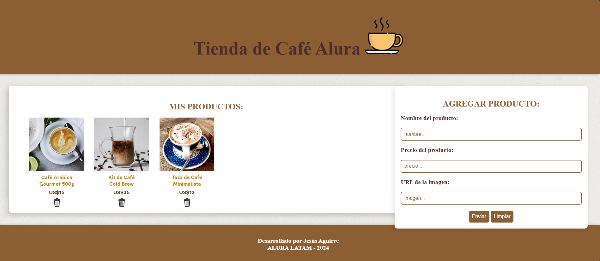

AluraGeek:
🛒 Un sitio de comercio electrónico para productos relacionados con la temática café, donde puedes explorar, agregar y administrar productos de manera dinámica.

📄 Descripción del Proyecto AluraGeek es una plataforma web creada como parte del Challenge Alura LATAM. Facilita la visualización de productos tecnológicos, la adición de nuevos artículos con detalles (nombre, precio, imagen) y la eliminación de productos existentes, utilizando un servidor JSON simulado a través de MockAPI.

✨ AluraGeek: Diseño limpio y funcional ✨
El diseño de AluraGeek destaca por su equilibrio visual, donde la sencillez y la funcionalidad se unen con elegancia. Los colores neutros predominan, creando un espacio tranquilo que invita a la navegación. La disposición de los elementos es ordenada y fluida, guiando al usuario suavemente a través del contenido. Cada detalle está pensado para ofrecer una experiencia accesible y sin distracciones. La tipografía, clara y precisa, complementa este enfoque minimalista, generando una atmósfera de claridad y facilidad de interacción.

Diseño web integral:
Este proyecto permite comprender el uso de APIs, JavaScript modular y la manipulación del DOM para crear una experiencia interactiva.

🚀 Características Principales
Visualización dinámica de productos:
Muestra una galería de productos cargados desde una API.

Añadir nuevos productos:
Formulario para agregar productos con campos de nombre, precio e imagen.

Eliminar productos:
Función para borrar productos específicos del listado.

Modal de visualización de imágenes:
Amplía la imagen al hacer clic sobre ella.

Pie de página con información del creador.
🛠️ Tecnologías Utilizadas
HTML5 y CSS3: Estructura y diseño de la página.

JavaScript: Manipulación dinámica del DOM y funcionalidades del proyecto.

MockAPI: Backend simulado para almacenar y manejar los datos de productos.

JSON: Formato de datos para interactuar con MockAPI.

🧩 Estructura del Proyecto
(Este apartado puede incluirse aquí si se detalla la estructura de carpetas y archivos del proyecto.)

🧩 Funcionamiento del Proyecto
Carga de productos:
Los productos se obtienen de MockAPI y se renderizan de manera dinámica.

Añadir producto:
Utiliza un formulario para agregar productos con los siguientes campos:

Nombre del producto

Precio

URL de imagen

Eliminar producto:
Cada producto incluye un botón para eliminarlo.

Ventana interactiva:
Al hacer clic en una imagen, se abre un modal con una vista ampliada.

👨‍💻 Proyecto derarrollado para ALURA LATAM 2024 En el programa ORACLE NEXT EDUCATION

